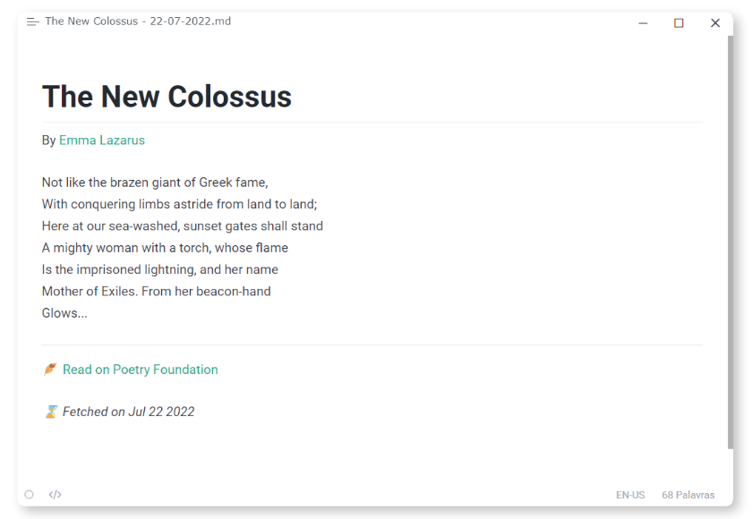

# 🪶 Poem of the day

A simple web scraper that access Poetry Foundation's [poem of the day](https://www.poetryfoundation.org/poems/poem-of-the-day) and save it to a local markdown file in the user's desktop folder.

## Dependencies
This project using the following dependencies:
- `requests`
- `Beautiful Soup`

Install them via the [pip](https://pypi.org/project/pip/) cli:
```bash
pip install -r requirements.txt
```

## Usage
To run the script, just run the main python file
```bash
python main.py
```

## Example


You can also see the [sample file](asset/sample.md).